#STAT 540 Seminar 2B

#Part 1 - First time ggplot-ing


```r
library(tidyverse)
```

```
## ── Attaching packages ─────────────────────────────────────────────── tidyverse 1.2.1 ──
```

```
## ✔ ggplot2 2.2.1     ✔ purrr   0.2.4
## ✔ tibble  1.4.1     ✔ dplyr   0.7.4
## ✔ tidyr   0.7.2     ✔ stringr 1.2.0
## ✔ readr   1.1.1     ✔ forcats 0.2.0
```

```
## ── Conflicts ────────────────────────────────────────────────── tidyverse_conflicts() ──
## ✖ dplyr::filter() masks stats::filter()
## ✖ dplyr::lag()    masks stats::lag()
```

###Do cars with big engines use more fuel than cars with small engines? 
####mpg dataset

```r
mpg
```

```
## # A tibble: 234 x 11
##    manufac… model   displ  year   cyl trans  drv     cty   hwy fl    class
##    <chr>    <chr>   <dbl> <int> <int> <chr>  <chr> <int> <int> <chr> <chr>
##  1 audi     a4       1.80  1999     4 auto(… f        18    29 p     comp…
##  2 audi     a4       1.80  1999     4 manua… f        21    29 p     comp…
##  3 audi     a4       2.00  2008     4 manua… f        20    31 p     comp…
##  4 audi     a4       2.00  2008     4 auto(… f        21    30 p     comp…
##  5 audi     a4       2.80  1999     6 auto(… f        16    26 p     comp…
##  6 audi     a4       2.80  1999     6 manua… f        18    26 p     comp…
##  7 audi     a4       3.10  2008     6 auto(… f        18    27 p     comp…
##  8 audi     a4 qua…  1.80  1999     4 manua… 4        18    26 p     comp…
##  9 audi     a4 qua…  1.80  1999     4 auto(… 4        16    25 p     comp…
## 10 audi     a4 qua…  2.00  2008     4 manua… 4        20    28 p     comp…
## # ... with 224 more rows
```
####Highway miles per gallon in function of engine displacement (L)

```r
ggplot(data = mpg) + geom_point(mapping = aes(x = displ, y = hwy))
```

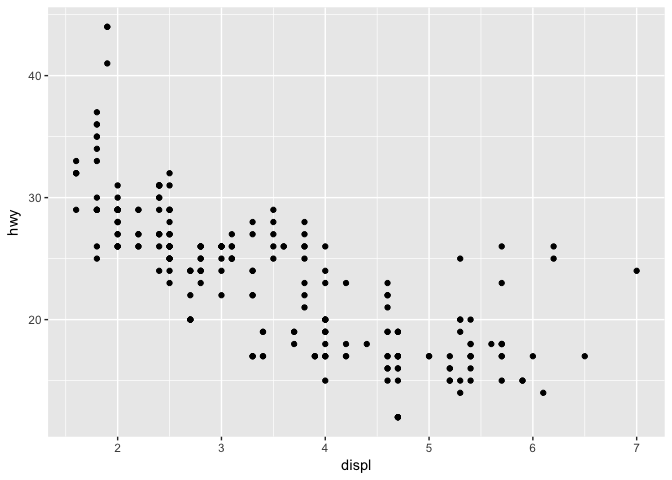<!-- -->


```r
ggplot(data = mpg) + geom_smooth(mapping = aes(x = displ, y = hwy))
```

```
## `geom_smooth()` using method = 'loess'
```

<!-- -->

```r
ggplot(data = mpg) + geom_density_2d(mapping = aes(x = displ, y = hwy))
```

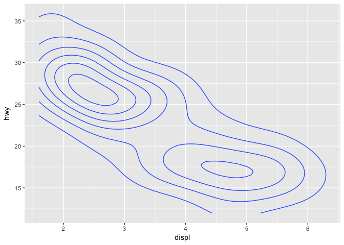<!-- -->

####City miles per gallon in function of engine displacement (L)

```r
ggplot(data = mpg) + geom_point(mapping = aes(x= displ, y = cty))
```

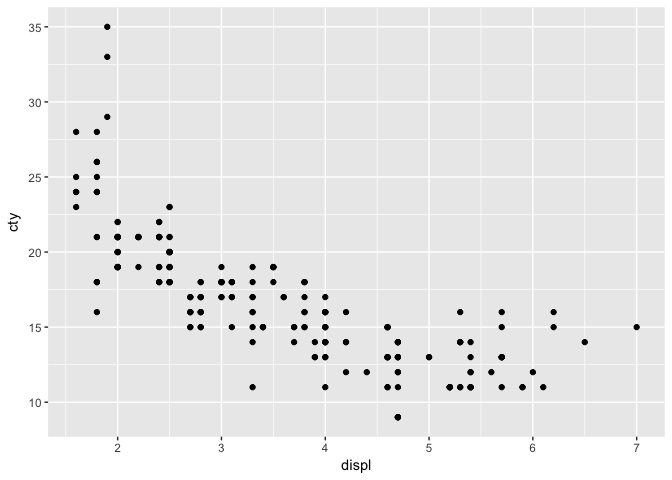<!-- -->

####Aestethic mappings
#####color

```r
ggplot(data = mpg) + geom_point(mapping = aes(x = displ, y = hwy, color = class))
```

<!-- -->

#####size

```r
ggplot(data = mpg) + geom_point(mapping = aes(x = displ, y = hwy, size = class))
```

```
## Warning: Using size for a discrete variable is not advised.
```

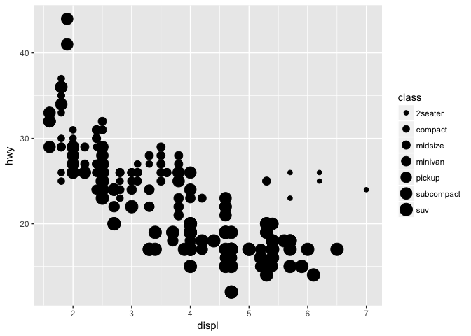<!-- -->

#Part 2 - The layered Grammar
##Smooth line
###Regression of Highway miles per gallon as a function of engine displacement(L)


```r
ggplot(data = mpg, mapping = aes(x = displ, y = hwy)) + geom_point() + geom_smooth()
```

```
## `geom_smooth()` using method = 'loess'
```

<!-- -->

##continuous variable in the 3rd dimension
###Regression of Highway miles per gallon as a function of engine displacement(L) with color points by year

```r
ggplot(data = mpg, mapping = aes(x = displ, y = hwy, color = year)) + geom_point() + geom_smooth()
```

```
## `geom_smooth()` using method = 'loess'
```

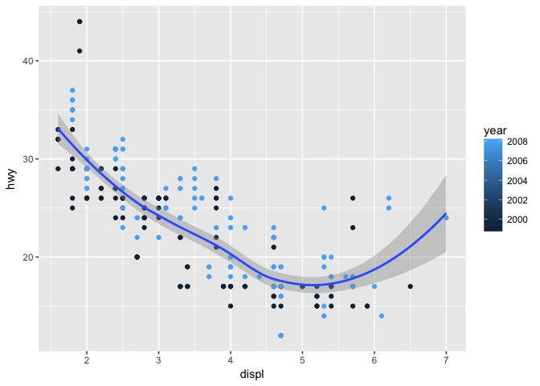<!-- -->

###Regression of Highway miles per gallon as a function of engine displacement(L) with color points by transmission

```r
ggplot(data = mpg, mapping = aes(x = displ, y = hwy, color = trans)) + geom_point() + geom_smooth()
```

```
## `geom_smooth()` using method = 'loess'
```

```
## Warning in simpleLoess(y, x, w, span, degree = degree, parametric =
## parametric, : span too small. fewer data values than degrees of freedom.
```

```
## Warning in simpleLoess(y, x, w, span, degree = degree, parametric =
## parametric, : pseudoinverse used at 1.9925
```

```
## Warning in simpleLoess(y, x, w, span, degree = degree, parametric =
## parametric, : neighborhood radius 1.1075
```

```
## Warning in simpleLoess(y, x, w, span, degree = degree, parametric =
## parametric, : reciprocal condition number 0
```

```
## Warning in simpleLoess(y, x, w, span, degree = degree, parametric =
## parametric, : There are other near singularities as well. 0.16606
```

```
## Warning in predLoess(object$y, object$x, newx = if
## (is.null(newdata)) object$x else if (is.data.frame(newdata))
## as.matrix(model.frame(delete.response(terms(object)), : span too small.
## fewer data values than degrees of freedom.
```

```
## Warning in predLoess(object$y, object$x, newx = if
## (is.null(newdata)) object$x else if (is.data.frame(newdata))
## as.matrix(model.frame(delete.response(terms(object)), : pseudoinverse used
## at 1.9925
```

```
## Warning in predLoess(object$y, object$x, newx = if
## (is.null(newdata)) object$x else if (is.data.frame(newdata))
## as.matrix(model.frame(delete.response(terms(object)), : neighborhood radius
## 1.1075
```

```
## Warning in predLoess(object$y, object$x, newx = if
## (is.null(newdata)) object$x else if (is.data.frame(newdata))
## as.matrix(model.frame(delete.response(terms(object)), : reciprocal
## condition number 0
```

```
## Warning in predLoess(object$y, object$x, newx = if
## (is.null(newdata)) object$x else if (is.data.frame(newdata))
## as.matrix(model.frame(delete.response(terms(object)), : There are other
## near singularities as well. 0.16606
```

```
## Warning in simpleLoess(y, x, w, span, degree = degree, parametric =
## parametric, : span too small. fewer data values than degrees of freedom.
```

```
## Warning in simpleLoess(y, x, w, span, degree = degree, parametric =
## parametric, : at 1.797
```

```
## Warning in simpleLoess(y, x, w, span, degree = degree, parametric =
## parametric, : radius 9e-06
```

```
## Warning in simpleLoess(y, x, w, span, degree = degree, parametric =
## parametric, : all data on boundary of neighborhood. make span bigger
```

```
## Warning in simpleLoess(y, x, w, span, degree = degree, parametric =
## parametric, : pseudoinverse used at 1.797
```

```
## Warning in simpleLoess(y, x, w, span, degree = degree, parametric =
## parametric, : neighborhood radius 0.003
```

```
## Warning in simpleLoess(y, x, w, span, degree = degree, parametric =
## parametric, : reciprocal condition number 1
```

```
## Warning in simpleLoess(y, x, w, span, degree = degree, parametric =
## parametric, : at 2.403
```

```
## Warning in simpleLoess(y, x, w, span, degree = degree, parametric =
## parametric, : radius 9e-06
```

```
## Warning in simpleLoess(y, x, w, span, degree = degree, parametric =
## parametric, : all data on boundary of neighborhood. make span bigger
```

```
## Warning in simpleLoess(y, x, w, span, degree = degree, parametric =
## parametric, : There are other near singularities as well. 9e-06
```

```
## Warning in simpleLoess(y, x, w, span, degree = degree, parametric =
## parametric, : zero-width neighborhood. make span bigger

## Warning in simpleLoess(y, x, w, span, degree = degree, parametric =
## parametric, : zero-width neighborhood. make span bigger
```

```
## Warning: Computation failed in `stat_smooth()`:
## NA/NaN/Inf in foreign function call (arg 5)
```

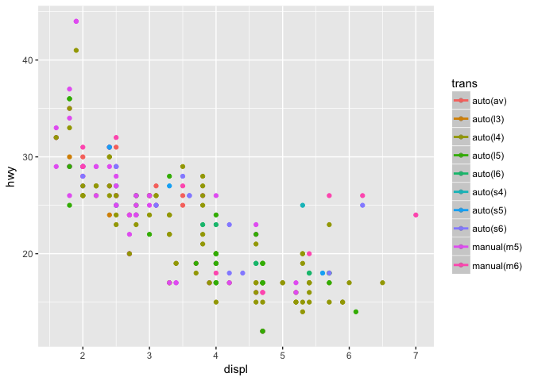<!-- -->

##bar chart
### Average fuel efficiencies for each vehicle class

```r
(averageEfficiency <- mpg %>% group_by(class) %>% summarise(fuel_efficiency = mean(hwy)))
```

```
## # A tibble: 7 x 2
##   class      fuel_efficiency
##   <chr>                <dbl>
## 1 2seater               24.8
## 2 compact               28.3
## 3 midsize               27.3
## 4 minivan               22.4
## 5 pickup                16.9
## 6 subcompact            28.1
## 7 suv                   18.1
```

```r
ggplot(averageEfficiency) + geom_bar(aes(x = class, y = fuel_efficiency, fill = class), stat = "identity") + ylab("Fuel Efficiency (miles per gallon)") + xlab("Vehicle Type")
```

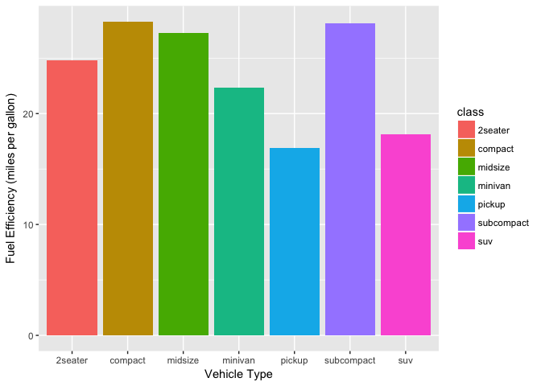<!-- -->

### Average fuel efficiencies for each vehicle class - SCALE REVERSED

```r
(averageEfficiency <- mpg %>% group_by(class) %>% summarise(fuel_efficiency = mean(hwy)))
```

```
## # A tibble: 7 x 2
##   class      fuel_efficiency
##   <chr>                <dbl>
## 1 2seater               24.8
## 2 compact               28.3
## 3 midsize               27.3
## 4 minivan               22.4
## 5 pickup                16.9
## 6 subcompact            28.1
## 7 suv                   18.1
```

```r
ggplot(averageEfficiency) + geom_bar(aes(x = class, y = fuel_efficiency, fill = class), stat = "identity") + ylab("Fuel Efficiency (miles per gallon)") + xlab("Vehicle Type") + scale_y_reverse()
```

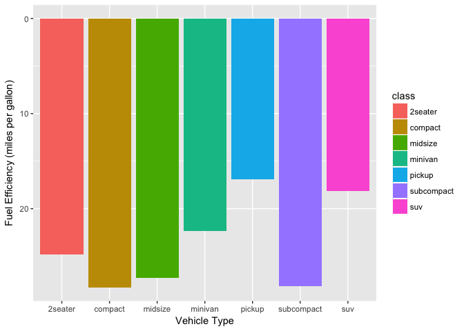<!-- -->

###Coordinate function
####flip

```r
(averageEfficiency <- mpg %>% group_by(class) %>% summarise(fuel_efficiency = mean(hwy)))
```

```
## # A tibble: 7 x 2
##   class      fuel_efficiency
##   <chr>                <dbl>
## 1 2seater               24.8
## 2 compact               28.3
## 3 midsize               27.3
## 4 minivan               22.4
## 5 pickup                16.9
## 6 subcompact            28.1
## 7 suv                   18.1
```

```r
ggplot(averageEfficiency) + geom_bar(aes(x = class, y = fuel_efficiency, fill = class), stat = "identity") + coord_flip()
```

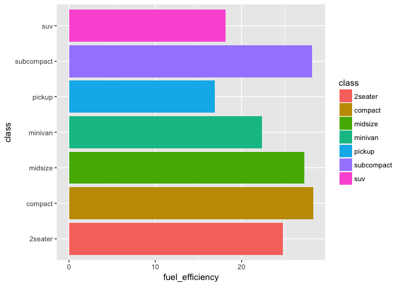<!-- -->

####polar

```r
(averageEfficiency <- mpg %>% group_by(class) %>% summarise(fuel_efficiency = mean(hwy)))
```

```
## # A tibble: 7 x 2
##   class      fuel_efficiency
##   <chr>                <dbl>
## 1 2seater               24.8
## 2 compact               28.3
## 3 midsize               27.3
## 4 minivan               22.4
## 5 pickup                16.9
## 6 subcompact            28.1
## 7 suv                   18.1
```

```r
ggplot(averageEfficiency) + geom_bar(aes(x = class, y = fuel_efficiency, fill = class), stat = "identity") + coord_polar()
```

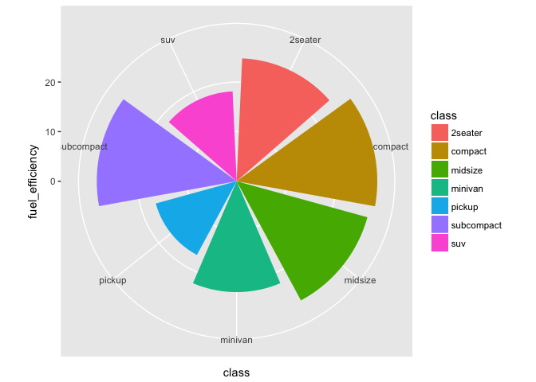<!-- -->

###Facet Function

```r
ggplot(data = mpg, mapping = aes(x = displ, y = hwy)) +geom_point() + facet_wrap(~class)
```

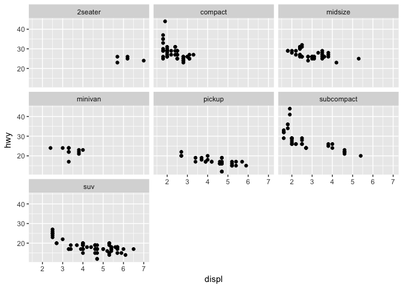<!-- -->

#Part 3: Deliverable
###Regression of Highway miles per gallon as a function of engine displacement(L) with color points by transmission

```r
ggplot(data = mpg, mapping = aes(x = displ, y = hwy, color = drv, size = class)) + geom_point() 
```

```
## Warning: Using size for a discrete variable is not advised.
```

<!-- -->
